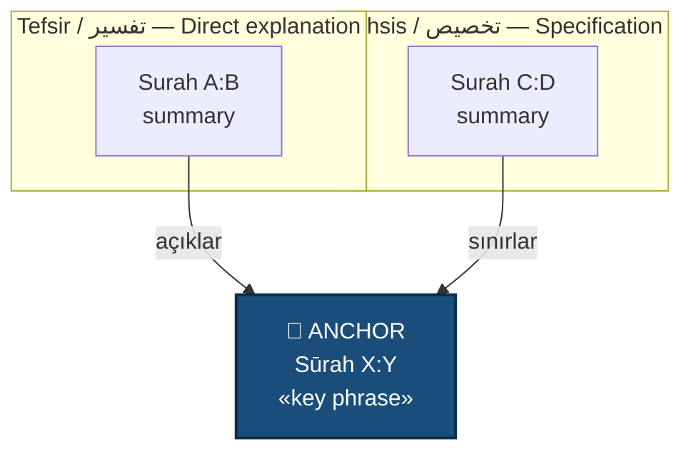

# Quran Connections — Açık Kuran API Edition

A skill for explaining a Quranic verse by mapping it to other Quranic verses that interpret it, and rendering that map as a visual Mermaid diagram. Powered by the local Açık Kuran API instance.

**Core principle:** The most authoritative method of tafsir is the Quran explaining itself. This skill operationalizes that method through the Açık Kuran API's REST endpoints and word-root concordance.

## When to trigger

Activate this skill when the user asks any of the following, in any language:

- "Explain ayah X using other ayahs"
- "What does the Quran itself say about Y?"
- "Connect this verse to others"
- "Show me how verses relate to this one"
- "Map/diagram the connections"
- "Find the ayahs that clarify this one"
- "How does the Quran interpret this?"
- Any request involving an ambiguous (`mujmal`), general (`ʿāmm`), absolute (`muṭlaq`), or unrestricted verse.

Turkish triggers: "ayeti başka ayetlerle açıkla", "Kuran'ı Kuran'la tefsir et", "bu ayet hangi ayetlerle bağlantılı", "bağlantı haritası çiz", "ilgili ayetleri göster".

## Tools (via Açık Kuran API CLI)

The Açık Kuran API is accessed through a Python CLI wrapper at:
```
python3 /Users/rak/projects/acikkuran-api/tools/acikkuran_cli.py <command> [options]
```

The CLI supports these commands — each maps to an API endpoint:

| Command | API Endpoint | Use For |
|---|---|---|
| `fetch REF -a AUTHOR` | `/surah/:id/verse/:num` | Retrieve Arabic text + translation |
| `translations REF` | `/surah/:id/verse/:num/translations` | Compare multiple translators |
| `words REF` | `/surah/:id/verse/:num/words` | Word-by-word root analysis |
| `verseparts REF` | `/surah/:id/verse/:num/verseparts` | Verse parts with root info + EN translation |
| `root LATIN` | `/root/latin/:chars` | Root meaning + all derivations |
| `root-parts LATIN -a AUTHOR -p PAGE` | `/root/latin/:chars/verseparts` | **Word concordance — most powerful tool** |
| `surahs` | `/surahs` | List all 114 surahs |
| `surah ID -a AUTHOR` | `/surah/:id` | Surah detail with all verses |
| `search QUERY` | `/search?q=QUERY` | Full-text search (MeiliSearch required) |
| `page NUM -a AUTHOR` | `/page/:num` | Mushaf page view |

Default author ID: `105` (Erhan Aktaş — Kerim Kur'an, Turkish).
For English: `103` (Edip-Layth). For Diyanet: `11`.

Add `--raw` to any command to get raw JSON.

## The golden rule: never confabulate verses

The Quran is too large for memory-based citation. Inventing a verse reference is catastrophic in this domain. **Always retrieve verses via the CLI before citing them.** Use prior knowledge to form hypotheses about where to look; use the tools to confirm before writing the diagram or prose.

If a tool call returns no result for a verse you were confident about, say so plainly. Do not paper over uncertainty.

## Workflow

Follow these steps in order for every query.

### Step 1 — Identify the anchor verse

The "anchor" is the verse the user wants explained. Resolve it precisely as `surah:verse`. If the user gave only a topic or paraphrase, ask for the specific reference. If they want you to find it, use `fetch` with your best guess and confirm with the user.

### Step 2 — Retrieve the anchor

```bash
python3 /Users/rak/projects/acikkuran-api/tools/acikkuran_cli.py fetch <surah>:<verse> -a <author_id>
```

This returns the Arabic (with full diacritics/harakat), both TR and EN transcriptions, the Turkish translation, and any footnotes. Read the full output.

### Step 3 — Analyze the anchor's Arabic roots

Run word-by-word analysis to extract the Arabic roots:

```bash
python3 /Users/rak/projects/acikkuran-api/tools/acikkuran_cli.py words <surah>:<verse>
```

Note every root that appears in the anchor. These are your primary search keys — the classical mufassirūn relied on `ishtiqāq kabīr` (root-based derivation) as their primary tool for finding intra-Quranic connections.

### Step 4 — Identify candidate connecting verses

Before searching, hypothesize which of the seven relationship types are likely to exist for this anchor. Work through the typology deliberately:

#### Connection typology (the seven relationships)

Label every edge in your final diagram with one of these:

1. **Tafsīr (تفسير) — direct explanation.** A later verse states explicitly what the anchor meant ambiguously. Example: al-Fātiḥa 1:7 ("those upon whom You bestowed favor") is explained by an-Nisāʾ 4:69 naming them (prophets, ṣiddīqūn, shuhadāʾ, ṣāliḥūn).
2. **Takhṣīṣ al-ʿāmm (تخصيص العام) — specification.** A general statement is narrowed by another. Example: "Allah permitted trade" (2:275) restricted by ribā prohibitions.
3. **Taqyīd al-muṭlaq (تقييد المطلق) — qualification.** An unrestricted verse gets a condition. Example: freeing "a slave" (4:92) qualified by "believing" elsewhere.
4. **Bayān al-mujmal (بيان المجمل) — clarification of summary.** "Establish ṣalāh" across the Quran; how-to verses operationalize it.
5. **Naskh / takhfīf (نسخ / تخفيف) — abrogation or lightening.** Use with care: state the classical position without adjudicating.
6. **Naẓīr (نظير) — parallel.** Same subject expressed similarly, reinforcing. Stories of prophets are full of these.
7. **Taʿqīb / istidrāk (تعقيب / استدراك) — qualification by contrast.** A verse that adds a caveat or counterbalance to the anchor's thrust.

#### Search strategies — use in parallel

1. **Root concordance** (primary tool): For each Arabic root in the anchor, run:
   ```bash
   python3 /Users/rak/projects/acikkuran-api/tools/acikkuran_cli.py root-parts <root_latin> -a <author_id>
   ```
   This returns every verse containing that root, with translation context. This is the most powerful tool — it parallels what classical mufassirūn did when they traced a root across the Quran.

2. **Known verse cross-references**: If you recall a specific verse that connects (e.g., 4:69 for "nimet"), verify it:
   ```bash
   python3 /Users/rak/projects/acikkuran-api/tools/acikkuran_cli.py fetch 4:69 -a <author_id>
   ```

3. **Multi-translation perspective**: For tricky passages, compare translations:
   ```bash
   python3 /Users/rak/projects/acikkuran-api/tools/acikkuran_cli.py translations <surah>:<verse>
   ```

Cast a wide net first, then prune. Aim for 3–7 connecting verses in the final diagram.

### Step 5 — Build the diagram

The diagram is the centerpiece of the output. **Use Mermaid `flowchart` syntax.**

Structure:
- The anchor verse is the central node, visually distinguished.
- Each connecting verse is a node labeled with `surah:verse` and a 3–6 word summary.
- Edges point *from connecting verse to anchor* (the connecting verse acts upon the anchor).
- Every edge has a relationship label in both Arabic transliteration and Turkish.
- Group nodes by relationship type using Mermaid subgraphs.

**Mermaid template:**



Turkish edge verbs: `açıklar`, `sınırlar`, `kayıtlar`, `tafsil eder`, `paraleldir`, `nesheder`, `istisna eder`.

**For Arabic in diagrams:** Mermaid handles Arabic inconsistently across renderers. Use transliteration in the diagram nodes and put the full Arabic in the prose companion below.

### Step 6 — Write the prose companion

After the diagram, write a structured explanation:

```markdown
## Çapa Ayet / Anchor

**Sūrah X:Y — [name]**

> [Arabic, with full diacritics — quoted from CLI output]
> [Turkish translation]

[2–4 sentences on what makes this verse need clarification.]

## Bağlantılar / Connections

### 1. [Relationship type] — Sūrah A:B

> [Arabic]
> [Turkish]

[3–5 sentences explaining how this verse relates to the anchor. What does it add, restrict, or clarify?]

[Repeat for each connection.]

## Sentez / Synthesis

[A short closing paragraph integrating the connections into a unified reading.]
```

### Step 7 — Verify before sending

Before responding, check:

- [ ] Every surah:verse reference came from a CLI tool result, not memory.
- [ ] Arabic text includes full diacritics (harakat) from the API output.
- [ ] Every edge in the diagram has a relationship label.
- [ ] Word-root concordance was used for at least the anchor's key terms.
- [ ] The diagram has 3–8 nodes (fewer feels thin, more becomes unreadable).

## Reference files

For deeper guidance, read:
- `references/typology.md` — Expanded examples of each relationship type with classical sources.
- `references/diagram-patterns.md` — Visual patterns for different structures with Mermaid templates.

## Worked example (compressed)

User: "Fâtiha'nın son ayetini başka ayetlerle açıkla."

1. Anchor: 1:7 — `صِرَاطَ الَّذِينَ أَنْعَمْتَ عَلَيْهِمْ...`
2. `fetch 1:7 -a 105` → confirmed Arabic + Erhan Aktaş translation.
3. `words 1:7` → roots: `SrT` (path), `nEm` (blessing/favor), `gDb` (anger/wrath), `Dll` (astray).
4. `root-parts nEm -a 105` → found 4:69 naming "those blessed" explicitly.
   `fetch 4:69 -a 105` → confirmed: prophets, ṣiddīqūn, shuhadāʾ, ṣāliḥūn.
   `root-parts gDb -a 105` → found 5:60 describing those Allah's anger fell upon.
   `fetch 5:60 -a 105` → confirmed.
   `root-parts Dll -a 105` → found 2:108.
   `fetch 2:108 -a 105` → confirmed: "whoever exchanges faith for disbelief has strayed."
5. Build Mermaid diagram with 1:7 as anchor, three subgraphs (nEm → tafsīr, gDb → tafsīr, Dll → tafsīr).
6. Prose companion with each verse in Arabic + translation + explanation of mechanism.
7. Synthesis: the three groups in 1:7 are not abstract — the Quran names them, and al-Fātiḥa becomes a request to be among specific identifiable people.

## What this skill does not do

- Does not perform tafsīr bi'r-raʾy (opinion-based commentary).
- Does not rank scholarly opinions — that requires hadith and uṣūl al-fiqh beyond scope.
- Does not produce fatwa.
- Does not reproduce the entire Quran verbatim — only the verses under discussion.
